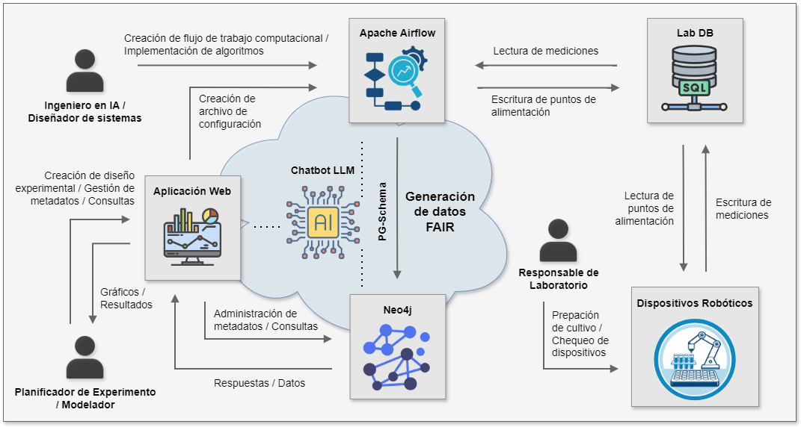

# Tesis Doctoral - Ing. Federico Mione

Código y documentación completa para reproducir los resultados y las conclusiones de la tesis doctoral denominada **"Un enfoque basado en grafos de conocimiento y grafos acíclicos dirigidos para la automatización y la reproducibilidad de flujos de trabajo computacionales en plataformas robóticas de experimentación intensiva"**.

*Tesista*: Federico M. Mione $^a$  
*Director*: Ernesto C. Martínez $^{a,b}$  
*Co-Director*: M. Nicolas Cruz Bournazou $^b$  

$^a$ *INGAR (CONICET - UTN). Avellaneda 3657, Santa Fe, Argentina* 
$^b$ *Technische Universität Berlin, Institute of Biotechnology, Chair of Bioprocess
Engineering. Berlin, Germany*

## Resumen

El objetivo central de esta tesis es demostrar que la reproducibilidad, inicialmente en su dimensión computacional relacionada al control de la experimentación, es alcanzable mediante el diseño de una infraestructura que combine la captura automatizada de datos y metadatos por medio de un orquestador de tareas, junto con un modelo de datos para almacenar el conocimiento de forma estructurada. Bajo esta premisa, se propuso y validó una arquitectura que integra Apache Airflow para la orquestación, Neo4j como base de datos orientada a grafos y PG-Schema como modelo formal para la representación de entidades y relaciones enriquecidas semánticamente.

## Vista de componentes

## Reproducibilidad - Caso de estudio 1

Esta rama del repositorio se encuentra dedicada al Caso de estudio 1. Para acceder al Caso de estudio 2, dirigirse a la rama *case2*.

### Licencia MATLAB

Se debe generar una licencia MATLAB válida para reproducir este caso. La misma se debe configurar con la versión **R2022a**, especificando el usuario **root** y la dirección MAC **02:42:ac:11:ff:12** para asegurar su funcionamiento en el contenedor Docker.

El archivo resultante se debe nombrar `license.lic` y se debe ubicar en la carpeta `images/matlab/`.

### Listado de pasos

Recordar que la simulación de este caso se ejecuta en tiempo real, por lo tanto, la duración será de 16 horas

Para reproducir los resultados, siga los siguientes pasos:

* Instalar [Git](https://git-scm.com/) y [Docker](https://www.docker.com/).

* Clonar el repositorio:

        git clone https://github.com/fmione/tesis-doctoral

* Navegar al directorio creado (*tesis-doctoral*) y desplegar el servicio inicial de Airflow con el siguiente comando:

        cd tesis-doctoral
        docker-compose up -d airflow-init 

* Luego, instalar los servicios restantes:

        docker-compose up -d

* Por favor, esperar hasta que la instalación finalice (puede demorar algunos minutos). Posteriormente, acceder a la plataforma Airflow mediante su interfaz web en la dirección http://localhost:8080/.
**Iniciar sesión con el usuario: airflow, y la contraseña: airflow.**

* Finalmente, se deben configurar algunas variables de Airflow:

    * En el panel seleccionar **Admin** > **Variables**.
    * Hacer click en **choose a file**, y seleccionar el archivo *config_matlab.json* ubicado en el directorio *dags*.
    * Una vez que el archivo JSON se ha cargado, presionar el botón **Import variables**.
    
    **IMPORTANTE**: La **variable host_path debe ser cambiada** por la ruta absoluta disponible de forma local donde se ubica la carpeta */dags*.

## Ejecución de DAGs
Existen dos DAGs: uno para el emulador (*Emulator_DAG*) y el restante para el control computacional (*Matlab_DAG*). Para ejecutar ambos, se debe activar el boton (*toggle*) correspondiente al DAG y luego presionar el botón play.

## Herramienta de monitoreo
Para visualizar la simulación (ya sea online u offline), se puede acceder a una herramienta con ploteos en la ruta: http://localhost:8501/. Aquí se debe seleccionar el RUN ID perteneciente al experimento, en este caso, el 623.

## Licencia
Este proyecto se encuentra bajo una Licencia MIT. Visualzar el archivo [LICENSE](./LICENSE) para más detalles.

